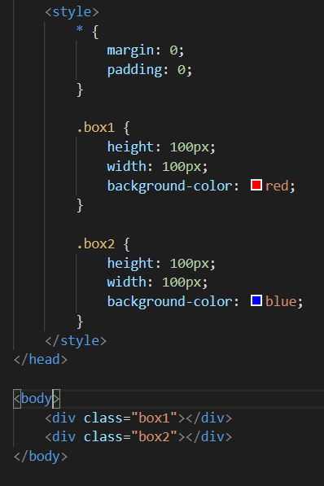
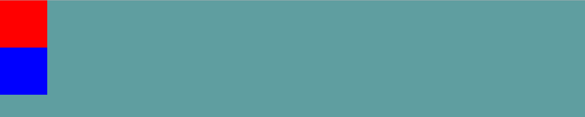
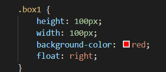
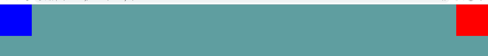
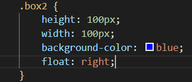

### 一、float 基础用法示例

1、我们先建两个 div 盒子,设置高度、宽度和背景颜色;

最开始两个盒子在网页上的位置如下:

然后我们将红色盒子浮动到右边

然后我们会发现红色盒子浮动到了右边,但是蓝色盒子就直接上移到了原先红色盒子的位置。

然后我们将蓝色盒子也浮动到右边看看效果:

我们会发现它会紧跟着红色盒子排列,而不会受块级元素影响独占一行。

### 二、浮动定位的基本规则

1、当元素的 float 属性取值为 left 或 right 时,元素属于浮动定位;  
2、若剩余空间无法放下浮动的盒子,则该盒子向下移动,直到具备足够的空间能容纳盒子,然后再向左或向右移动;  
3、浮动盒子的顶边不得高于上一个盒子的顶边;  
4、浮动盒子在摆放时,要避开常规流盒子;常规流盒子在摆放时,无视浮动盒子;  
5、常规流盒子的自动高度计算时,无视浮动盒子;  
6、清除浮动:clear:both(左或右)。
