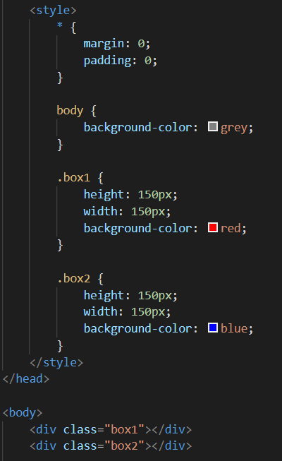
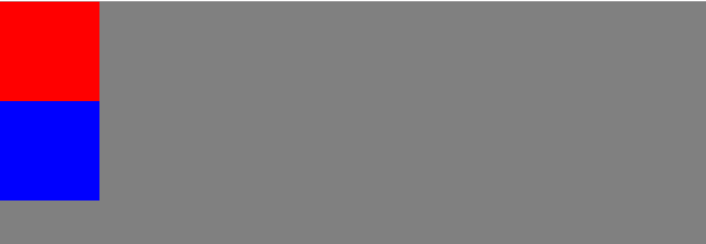
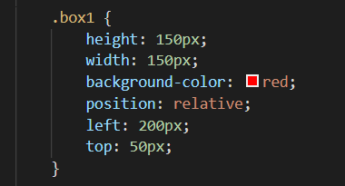
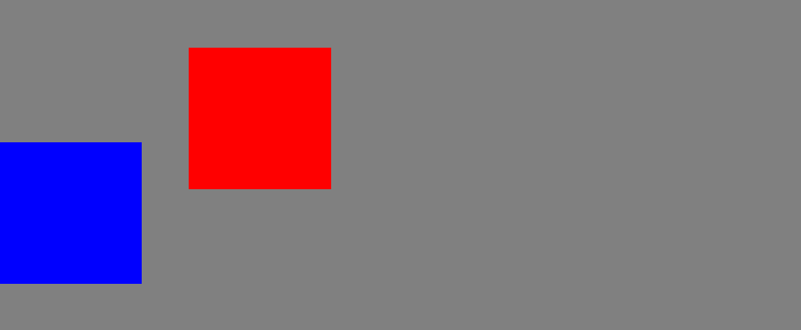
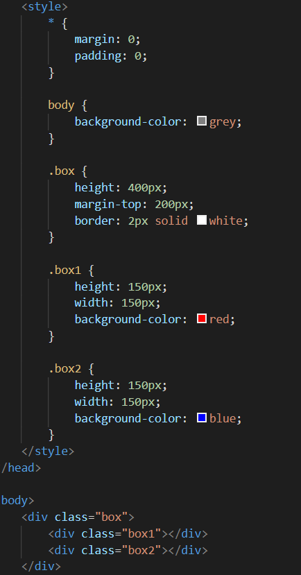
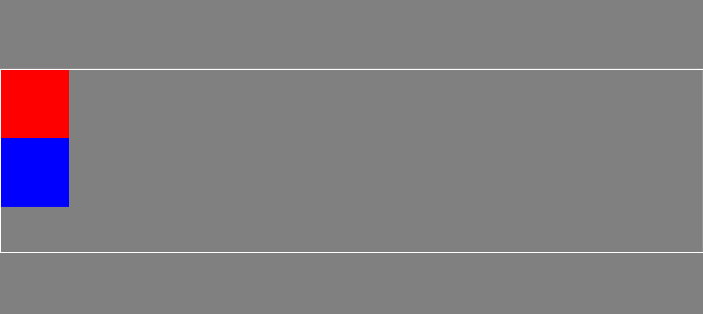
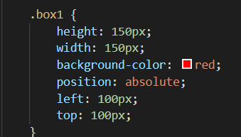
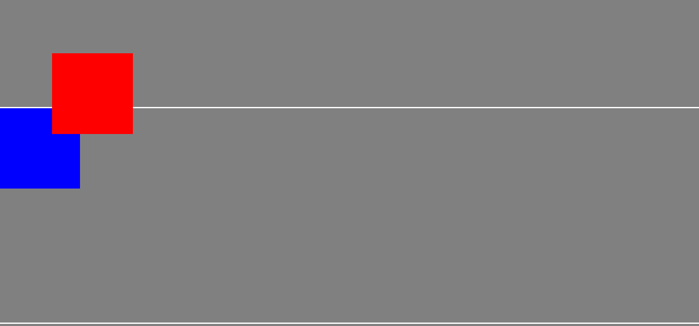
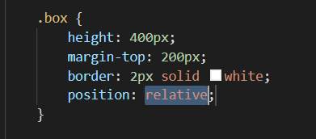
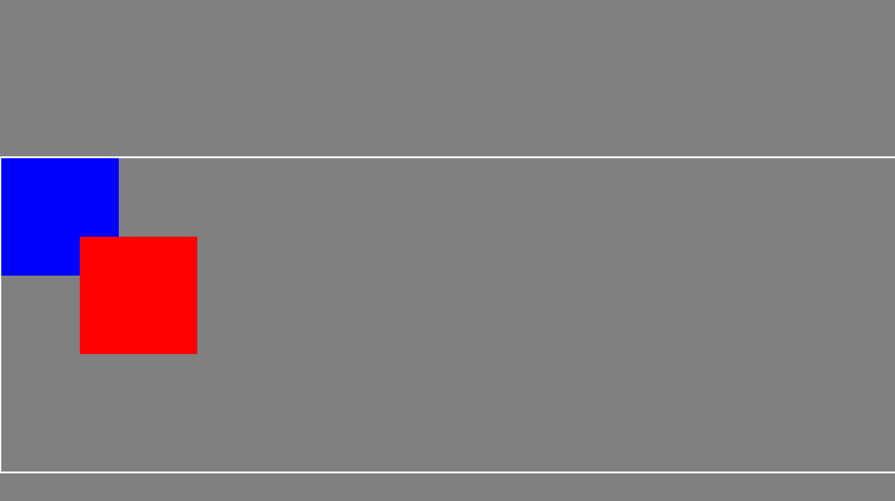

### 一、相对定位(position:relative)

1、相对定位:将盒子的 position 属性设置为 relative;可通过 left、top、right、bottom 设置偏移量

相对定位基础用法示例:
我们先在页面设置两个 div 盒子(第一个红色;第二个蓝色)

最初的位置

我们将第一个盒子进行相对定位;离左边 200px;离顶部 50px;

得到的效果是;

得出结论:

1、红色盒子是相对于盒子最初的位置向左偏移 200px, 向下偏移 50px;

2、盒子偏移后也不会影响其他盒子;偏移后最初的位置会留下一个占位的

### 二、绝对定位(position:absolute)

absolute 用法示例:

1、我们设置一个 div 盒子 box{设置好高度、边框和离页面顶部的距离};里面还装有两个小盒子, 第一个红色, 第二个蓝色;

最初的位置

然后我们让第一个红色盒子设置绝对定位属性{left:100px;top:100px;}

效果图如下:

结论:1、绝对定位的盒子, 最初的位置不会再占用, 后面的盒子会填上空缺;

2、在父元素(也就是大盒子 box)没有 position 属性时, 子元素(红色盒子)是以屏幕为参照物进行位置的定位的;

从上面所说, 我们在大盒子 box 设置一个 position 属性时看看有没有什么不同的效果:

得到的效果是:

由此可见:如果父元素有 position 属性时;他就会以父元素为参照物进行偏移;当然如果父元素没有 position 这个属性, 他就会一级一级往上找,

绝对定位相对于的位置偏移是发生在上层元素上是否有 position 这个属性, 如果没找到, 就相对于整个屏幕

### 三、固定定位(position:fixed)

固定定位,相对于浏览器窗口进行定位,脱离原来的文档流

### 四、自动定位(position:static)

static:自动定位(默认定位方式)唯一的用处就是用来取消定位

### 补充说明

1、z-index 可以设置层叠的置, 越大越在上层(例如:z-index:1000;)
