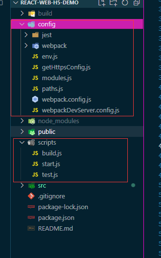
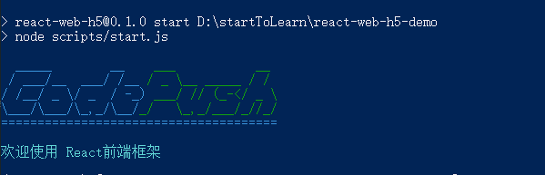

::: tip

学习的好伙伴  
[react 安装官方文档地址](https://react.docschina.org/docs/create-a-new-react-app.html)
:::

### 一、一键生成

按照 react 官网说明需要在你的电脑上安装 Node >= 8.10 和 npm >= 5.6。然后再输入指令，一键生成基础版的项目架构

```js
npx create-react-app my-app
cd my-app
npm start
```

::: warning
注意  
第一行的 npx 不是拼写错误 —— 它是 npm 5.2+ 附带的 package 运行工具。
:::

### 二、react 基础框架二次自定义配置

一键生成的 react 框架自动隐藏了 webpack 相关的文件和依赖,需要执行命令，展示配置

```js
npm run eject
```

::: warning
注意  
展示 webpack 配置的指令不可逆
:::

执行后，项目中会多出 config 文件夹和 scripts 文件中，初始有开发、生产和测试三个环境，可修改相应配置达到不同的效果



### 三、个人记录

以前不知道为什么有些项目启动的时候会在控制台打印一些莫名的输出,原因是在他们在配置文件里刻意加的打印，没得多的作用。就是玩

```js
const chalk = require("react-dev-utils/chalk"); //也可以单独下载chalk插件
console.log(
    chalk.cyan("  _____        __  " + chalk.green("  ___           __ "))
);
console.log(
    chalk.cyan(" / ___/__  ___/ /__" + chalk.green(" / _ \\__ _____ / / "))
);
console.log(
    chalk.cyan("/ /__/ _ \\/ _  / -_)" + chalk.green(" ___/ // (_-</ _ \\"))
);
console.log(
    chalk.cyan("\\___/\\___/\\_,_/\\__/" + chalk.green("_/   \\_,_/___/_//_/"))
);
console.log(chalk.cyan("======================================"));
console.log(chalk.bold.cyan("\n欢迎使用 React前端框架\n"));
```


