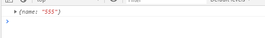

::: tip

学习的好伙伴  
[react components 官方文档地址](https://react.docschina.org/docs/components-and-props.html)  
[react components 菜鸟教程文档地址](https://www.runoob.com/react/react-components.html)
[react PropTypes 官方文档地址](https://react.docschina.org/docs/typechecking-with-proptypes.html)

:::

### 一、什么是模块和模块化？

#### 1、模块

向外提供特定功能的 js 程序，一般就是一个 js 文件；
比如说：我有一个 index.js，根据不同的功能、业务拆分成 a.js、b.js 和 c.js，被拆分的文件就是模块

#### 2、模块化

当应用的 js 都以模块来编写，那这个应用就是模块化应用

### 二、什么是组件和组件化？

#### 1、组件

用来实现局部功能效果的代码和资源集合（不限 html、css、image、js）

#### 2、组件化

当应用是以多组件的方式实现，这个应用就是组件化的应用

### 三、函数组件

```jsx
function MyButton() {
    return <div className="func-components">函数组件</div>;
}
```

使用的时候直接使用\<MyButton>\</MyButton>

### 四、class 组件

```jsx
class MyButton extends React.Component {
    render() {
        return (
            <div style={{ marginTop: "40px" }}>
                <div className="class-components">类组件</div>
            </div>
        );
    }
}
```

::: warning

组件名首字母必须大写

:::

### 五、porps

::: tip
react 中组件传递的 porps 中属性不可修改
:::

比如我有一个 MyButton 的组件 使用时直接传递参数

```jsx
<MyButton name="555"></MyButton>
```

MyButton 通过 porps 接收这个参数

```jsx
// 函数接收
function MyButton(props) {
    console.log(props);
    return (
        <Button type="primary" onClick={handleClick}>
            跳转
        </Button>
    );
}
// 类组件接收
export class MyButton extends React.Component {
    constructor(props) {
        super(props);
        console.log(props);
    }
    render() {
        return (
            <div style={{ marginTop: "40px" }}>
                <div className="class-components">类组件</div>
            </div>
        );
    }
}
```

props 打印结果  


### 六、PropTypes

::: warning

自 React v15.5 起，React.PropTypes 已移入另一个包中。请使用 prop-types 库 代替。

:::

要在组件的 props 上进行类型检查

```jsx
//官网例子
import PropTypes from "prop-types";

class Greeting extends React.Component {
    constructor(porps) {
        super(porps);
        //写法第一种
        this.propTypes = {
            name: PropTypes.string,
        };
    }
    render() {
        return <h1>Hello, {this.props.name}</h1>;
    }
}
//写法第二种
// Greeting.propTypes = {
//     name: PropTypes.string,
// };
```

#### 默认 Prop 值

```jsx
class Greeting extends React.Component {
    //写法第一种
    static defaultProps = {
        name: "stranger",
    };

    render() {
        return <div>Hello, {this.props.name}</div>;
    }
}

//写法第二种
// 指定 props 的默认值：
// Greeting.defaultProps = {
//     name: "Stranger",
// };
```
