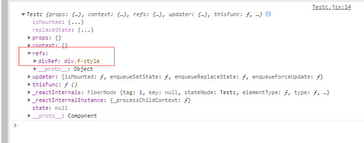
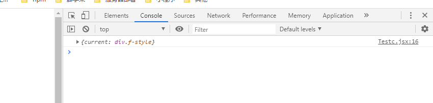

### 一、字符串形式的 ref

直接在节点上绑定一个 ref 属性，并取名"divRef"，点击输出结果 this

```jsx
import React from "react";
export class Testc extends React.Component {
    constructor(props) {
        super(props);
        this.thisFunc = this.thisFunc.bind(this);
    }
    thisFunc() {
        console.log(this);
    }
    render() {
        return (
            <div className="f-style" ref="divRef" onClick={this.thisFunc}>
                组件一
            </div>
        );
    }
}
```

#### 结果



:::warning

官方已不建议使用，原因：官方直接指向 GitHub 的 react 的讨论区，大概总结为效率不好

:::

### 二、回调函数式的 ref

```jsx
import React from "react";
export class Testc extends React.Component {
    constructor(props) {
        super(props);
        this.thisFunc = this.thisFunc.bind(this);
    }
    thisFunc() {
        //直接输出this.divRef
        console.log(this.divRef);
    }
    render() {
        return (
            <div
                className="f-style"
                ref={(currentNode) => {
                    this.divRef = currentNode;
                }}
                onClick={this.thisFunc}
            >
                组件一
            </div>
        );
    }
}
```

::: warning
`注意：`
上述例子 ref 回调函数是以`内联函数`的方式定义的，在更新过程中它会被执行`两次`，第一次传入参数` null`，然后第二次会传入参数 `DOM 元素`。这是因为在每次渲染时会创建一个新的函数实例，所以 React 清空旧的 ref 并且设置新的

:::

**可通过将 ref 的回调函数定义成 class 的绑定函数的方式可以避免上述问题**

```jsx
import React from "react";
export class Testc extends React.Component {
    constructor(props) {
        super(props);
        this.thisFunc = this.thisFunc.bind(this);
    }
    saveDiv = (c) => {
        this.divRef = c;
    };
    thisFunc() {
        //直接访问this.divRef
        console.log(this.divRef);
    }
    render() {
        return (
            <div className="f-style" ref={this.saveDiv} onClick={this.thisFunc}>
                组件一
            </div>
        );
    }
}
```

### 三、React.createRef() 创建 ref

**React.createRef()可以返回一个容器，该容器可以存储被 ref 所标识的节点**

```jsx
import React from "react";
export class Testc extends React.Component {
    constructor(props) {
        super(props);
        this.thisFunc = this.thisFunc.bind(this);
        this.myRef = React.createRef();
    }
    thisFunc() {
        //直接访问this.divRef
        console.log(this.myRef);
    }
    render() {
        return (
            <div className="f-style" ref={this.myRef} onClick={this.thisFunc}>
                组件一
            </div>
        );
    }
}
```

#### 结果



::: warning
`注意：`
React.createRef()生成的容器是`专人专用`的,只能存一个，多个相同的存储，后面的会直接顶掉前面已存储的

:::
